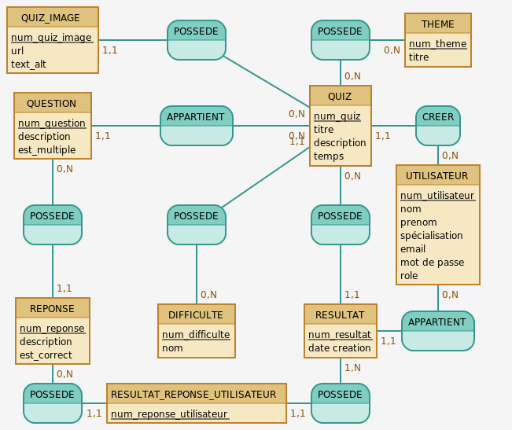

# Conception MCD-MLD

## MCD


## MLD


### script Mocodo
```
POSSEDE6, 1N RESULTAT, 0N REPONSE
APPARTIENT2, 0N UTILISATEUR,  11 RESULTAT
UTILISATEUR: num_utilisateur, nom, prenom, email, mot de passe
CREER, 11 QUIZ, 0N UTILISATEUR
:
:

REPONSE: num_reponse, description, est_correct
RESULTAT: num_resultat, date creation
POSSEDE5, 0N QUIZ, 11 RESULTAT
QUIZ: num_quiz, titre, description
POSSEDE, 0N QUIZ, 0N THEME
THEME: num_theme, titre

POSSEDE2, 0N QUESTION, 11 REPONSE
QUESTION: num_question, description, est_multiple
APPARTIENT, 0N QUIZ, 11 QUESTION
POSSEDE3, 11 QUIZ, 0N DIFFICULTE
DIFFICULTE: num_difficulte, nom
:

```