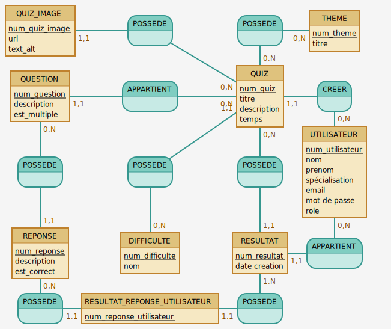

# Conception MCD-MLD

## MCD


## MLD


### script Mocodo
```
QUIZ_IMAGE: num_quiz_image, url, text_alt
POSSEDE9, 0N QUIZ, 11 QUIZ_IMAGE
POSSEDE, 0N QUIZ, 0N THEME
THEME: num_theme, titre
:

QUESTION: num_question, description, est_multiple
APPARTIENT, 0N QUIZ, 11 QUESTION
QUIZ: num_quiz, titre, description, temps
CREER, 11 QUIZ, 0N UTILISATEUR

POSSEDE2, 0N QUESTION, 11 REPONSE
POSSEDE3, 11 QUIZ, 0N DIFFICULTE
POSSEDE5, 0N QUIZ, 11 RESULTAT
UTILISATEUR: num_utilisateur, nom, prenom, spécialisation, email, mot de passe, role

REPONSE: num_reponse, description, est_correct
DIFFICULTE: num_difficulte, nom
RESULTAT: num_resultat, date creation
APPARTIENT2, 0N UTILISATEUR,  11 RESULTAT
:

POSSEDE8, 0N REPONSE, 11 RESULTAT_REPONSE_UTILISATEUR
RESULTAT_REPONSE_UTILISATEUR: num_reponse_utilisateur
POSSEDE6, 1N RESULTAT, 11 RESULTAT_REPONSE_UTILISATEUR
:
:


```