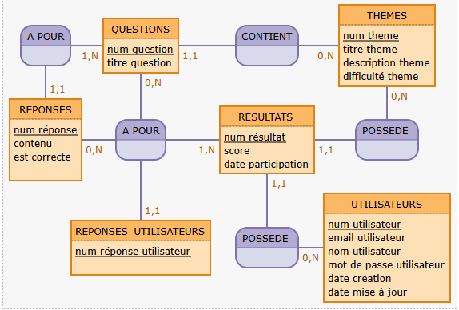
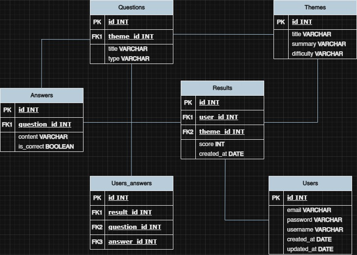

# MCD-MLD

## Code mocodo

```
A POUR, 1N QUESTIONS, 11 REPONSES
QUESTIONS: num question, titre question, type question
CONTIENT, 0N THEMES, 11 QUESTIONS
THEMES: num theme, titre theme, description theme, difficulté theme

REPONSES: num réponse, contenu, est correcte, 
A POUR2, 1N RESULTATS, 0N REPONSES, 0N QUESTIONS, 11 REPONSES_UTILISATEURS
RESULTATS: num résultat, score, date participation
POSSEDE 3, 11 RESULTATS, 0N THEMES

:
REPONSES_UTILISATEURS: num réponse utilisateur, 
POSSEDE 2, 11 RESULTATS, 0N UTILISATEURS
UTILISATEURS: num utilisateur, email utilisateur, nom utilisateur, mot de passe utilisateur, date creation, date mise à jour
```

## Schéma MCD 



## Schéma MLD 



